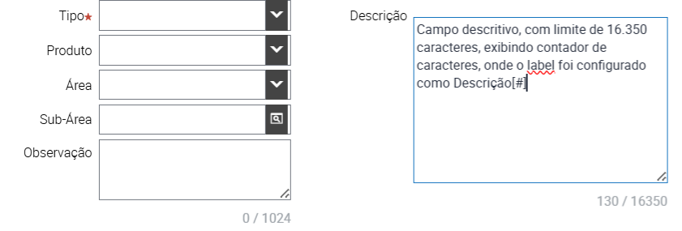

# 🚀 Siebel Open UI: Contador de Caracteres Automático / Automatic Character Counter

Esta solução adiciona um contador dinâmico a campos Text e TextArea no Siebel Open UI. 
*This solution adds a dynamic counter to Text and TextArea fields in Siebel Open UI.*

---

### 📋 Descrição
Adiciona um contador dinâmico (ex: `120 / 2000`) a campos **Text** e **TextArea**, alinhado à direita e sincronizado com eventos de teclado (Esc, Ctrl+U) e navegação de registros.

### 🛠️ Configuração

#### 1. Servidor (Arquivos)
*   **Arquivo:** Faça download do arquivo [custom_char_counter_PR.js](./custom_char_counter_PR.js)
*   **Caminho:** Coloque o arquivo no servidor do Siebel na pasta de scripts customizados, exemplo: `/scripts/siebel/custom/`
*   **Ação:** Certifique-se de que o arquivo tenha permissões de leitura para o usuário `siebel`.

#### 2. Web Tools (Repositório)
A ativação é feita via repositório, sem alterar código para cada novo campo:
1.  Abra a **Applet** desejada.
2.  No **Control**, localize a propriedade **Legenda** (ou Label).
3.  Adicione o marcador `[#]` ao final do texto (Exemplo: `Descrição[#]`).
4.  Faça o **Deliver** das alterações.

#### 3. Manifesto (Administração)
Para que o Siebel carregue o script na Applet específica:
1.  **Manifest Files:** Crie um novo registro apontando para `siebel/custom/custom_char_counter_PR.js`.
2.  **Manifest Administration:**
    *   **UI Object:** Type: `Applet` | Usage Type: `Physical Renderer` | Name: `[Nome da sua Applet]`
    *   **Object Expression:** Expression: `(vazio)` | Level: `1`
    *   **Files:** Adicione o arquivo criado no passo 1.

---

### 📋 Description (ENU)
Adds a dynamic counter (e.g., `120 / 2000`) to **Text** and **TextArea** fields, right-aligned and synced with keyboard events (Esc, Ctrl+U) and record navigation.

### 🛠️ Setup

#### 1. Server (File Setup)
*   **File:** [custom_char_counter_PR.js](./custom_char_counter_PR.js)
*   **Path:** `/scripts/siebel/custom/`
*   **Action:** Ensure the file has read permissions for the `siebel` user.

#### 2. Web Tools (Configuration)
Activation is repository-based, no need to touch the code for every new field:
1.  Open the desired **Applet**.
2.  Go to the **Control** and locate the **Caption** (or Label) property.
3.  Add the marker `[#]` at the end of the text (Example: `Description[#]`).
4.  **Deliver** the changes.

#### 3. Manifesto (Registration)
Tell Siebel to load the script for your specific Applet:
1.  **Manifest Files:** Create a new record pointing to `siebel/custom/custom_char_counter_PR.js`.
2.  **Manifest Administration:**
    *   **UI Object:** Type: `Applet` | Usage Type: `Physical Renderer` | Name: `[Your Applet Name]`
    *   **Object Expression:** Expression: `(blank)` | Level: `1`
    *   **Files:** Add the file path created in step 1.

---

## 🧪 Validação e Ajustes / Validation & Adjustments
*   **Teste / Test:** Limpe o cache (`Ctrl + F5`). O marcador `[#]` deve sumir e dar lugar ao contador cinza. / Clear browser cache (`Ctrl + F5`). The `[#]` marker should disappear and be replaced by the gray counter.
*   **Customização / Customization:** Edite as variáveis na seção `CUSTOMIZAÇÃO` no topo do arquivo JS para alterar cores ou fontes. / Edit the variables in the `CUSTOMIZATION` section at the top of the JS file to change colors or fonts.
